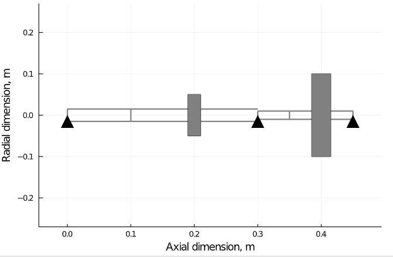

# Flywheel
Finite element simulation of rotating equipment in Julia language,  with 1-D Euler beam shaft segments and linear bearing impedance.
Based on "*Linear and Nonlinear Rotordynamics: A Modern Treatment with Applications, Second Edition*" by Yukio Ishida and Toshio Yamamoto. ISBN:9783527409426\
Main features:
* Import of custom machinery geometry from file
* Calculation of the inertia, gyroscopy, damping and stiffness matrices
* Estimation of resonance frequencies, critical speeds, Campbell diagram
* Provisionings for time transient numerical simulation

![](pictures/SampleBlue.PNG
