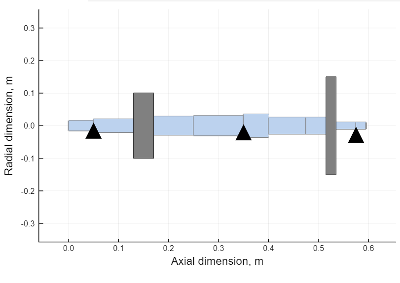

# Flywheel
Finite element method (FEM) formulation of rotating equipment in <em>Julia</em> language, featuring structural dynamics with 1-D  Euler-Bernoulli beam shaft segments, gyroscoping coupling and linear bearing impedance.\

## Features:
* Import of custom machinery geometry from file
* Export of inertia, gyroscopy, damping & stiffness matrices
* Calculation of resonance frequencies and deformation due to gravity
* Run-up time-transient numerical simulation

## Installation
* Fetch the code locally, place it into your directory
* In Julia, run as: `(v1.5) pkg> add "C:\Users\myusername\.julia\dev\Flywheel"`
* Then add the package with `using Flywheel` and place the "Rotor_Sample.txt" blueprint in your current Julia directory

## Usage
* Edit the blueprint file, cf. headers for the meaning of each column
* `Flywheel_blueprint("Rotor_Sample")` shows a machine overview, bearings are depicted as triangles, solid discs as grey elements
* `M,G,D,K=Flywheel_fematrices("Rotor_Sample")` returns the finite element matrices based on your rotor dynamic system
* `A,B=Flywheel_statespace(M,G,D,K,800)` generates the state matrix A and input matrix B in the state-space domain, at a rotational speed of 800rev/min
* `sort(abs.(imag(eigvals(A)*60/2/pi)))` lists the resonance frequencies of the Jacobian (state matrix A) in rev/min at the above selected rotational speed
* `GravForce=Flywheel_gravity("Rotor_Ishida",9.806,K)` depichts the static deformation due to  gravitational acceleration of 9.806m/s^2
* `Flywheel_waterfall(M,G,D,K,1000,4000)` creates a  waterfall diagram of eigenfrequencies between the rotational speeds 1000 and 4000 rev/min

## References
* *Linear and Nonlinear Rotordynamics: A Modern Treatment with Applications, Second Edition* by Y. Ishida and T. Yamamoto (ISBN 978-3-527-40942-6)
* *Dynamics of Rotating Systems*" by G. Genta (ISBN 978-0-387-28687-7)

## License
GPL-3.0 License
 
## Author
Lysandros Anastasopoulos
