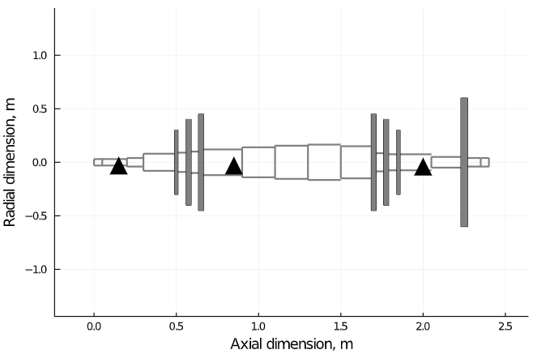

# Flywheel
Finite element method (FEM) formulation of custom rotating equipment in Julia language, featuring 1-D  Euler-Bernoulli beam shaft segments, gyroscoping coupling and linear bearing impedance.\

## Features:
* Import of custom machinery geometry from file
* Export of the inertia, gyroscopy, damping and stiffness matrices
* Calculation of resonance frequencies and deformation due to gravity
* Run-up time-transient numerical simulation

## Usage
* Edit the text file "Rotor_Sample.txt" that comes with the installation, cf. headers for the meaning of each column
* Ensure file is located in you current Julia directory
* `Flywheel_blueprint("Rotor_Sample")` illustrates the blueprint, bearings are depicted as triangles, solid discs as grey elements
* `M,G,C,K=Flywheel_fematrices("Rotor_Sample")` returns the finite element matrices based on your rotor dynamic system
* `A,B=Flywheel_statespace("Rotor_Sample",800)` generates the state matrix A and input matrix B in the state-space domain, at a rotational speed of 800rev/min
* `sort(abs.(imag(eigvals(A)*60/2/pi)))` lists the resonance frequencies of the Jacobian (state matrix A) in rev/min at the above selected rotational speed

## References
* *Linear and Nonlinear Rotordynamics: A Modern Treatment with Applications, Second Edition* by Y. Ishida and T. Yamamoto (ISBN 978-3-527-40942-6)
* *Dynamics of Rotating Systems*" by G. Genta (ISBN 978-0-387-28687-7)

## License
Eclipse Public License 2.0

## Author
Lysandros Anastasopoulos
